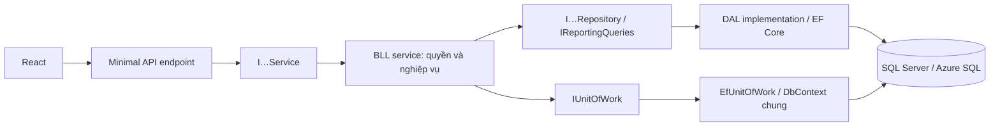
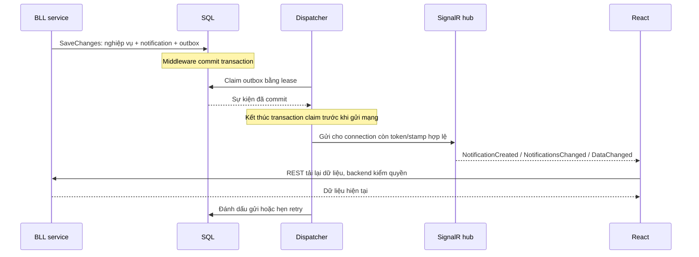

# Bảng phân tích HRCMS để báo cáo và trả lời vấn đáp

Ngày đối chiếu: 08/10/2026. Bản cập nhật sau khi tách interface/repository/Unit of Work, tích hợp SignalR, Việt hóa thông báo và kiểm tra Azure SQL dùng chung. Mã nguồn đang ở working tree, chưa commit/push. Chi tiết vận hành: [REPOSITORY_SIGNALR_IMPLEMENTATION.md](REPOSITORY_SIGNALR_IMPLEMENTATION.md).

## 1. Cách giới thiệu dự án trong 45 giây

“HRCMS là hệ thống quản lý câu lạc bộ ngựa, hỗ trợ từ tiếp nhận hồ sơ ngựa, xét duyệt, phân công nhân sự đến huấn luyện, y tế, chăm sóc và quản lý kho. Frontend dùng React/Vite; backend dùng ASP.NET Core .NET 10 và được chia thành API, BLL, DAL. Dữ liệu lưu bằng EF Core trên SQL Server/Azure SQL. Điểm chính là mỗi người chỉ được thao tác đúng vai trò và đúng phạm vi ngựa; các luồng quan trọng được kiểm soát bằng trạng thái, giao dịch và lịch sử thao tác.”

## 2. Bảng cấu trúc và trách nhiệm

| Thành phần | Nhiệm vụ | Ví dụ | Cách giải thích với thầy |
|---|---|---|---|
| Frontend React/Vite | Hiển thị, nhập liệu, điều hướng và gọi API | Pages, components, services/Axios | Giao diện nhận thao tác người dùng rồi gửi HTTP tới backend. |
| API — `Horse_BackEnd` | Nhận request, kiểm hợp đồng đầu vào/quyền endpoint, trả HTTP | `Endpoints/HorseEndpoints.cs` | Đây là cửa vào hệ thống; dự án dùng Minimal API. |
| BLL — `HorseClub.BLL` | Quyết định nghiệp vụ, trạng thái, quyền theo đối tượng | `Horses/HorseRegistrationService.cs` | Quyết định hồ sơ có được gửi/duyệt hay buổi tập có được bắt đầu không. |
| DAL — `HorseClub.DAL` | Repository/query, Unit of Work, entity, EF mapping và migration | `Repositories/RegistrationRepository.cs`, `Data/EfUnitOfWork.cs` | Tập trung truy vấn và lưu dữ liệu; không quyết định ai được duyệt hay chuyển trạng thái. |
| Infrastructure | Xử lý HTTP và cơ chế kỹ thuật chung | Error/Transaction middleware, bearer handler | Lỗi và giao dịch được xử lý thống nhất giữa các module. |
| Contracts | DTO đầu vào/đầu ra | `RegistrationDraftRequest`, `SessionRequest` | DTO là hợp đồng trao đổi, entity là đối tượng lưu dữ liệu. Một số response hiện vẫn chứa entity. |
| Common | Chính sách dùng lại | `ClubAccess`, `Ensure`, `ClubCalendar`, `ClubEvents` | Tránh mỗi module tự viết một cách kiểm quyền, thời gian hay audit khác nhau. |
| Workers | Email, nhắc việc, dọn tài khoản chờ và phát realtime | EmailWorker, ReminderWorker, AccountCleanupWorker, RealtimeDispatchWorker | Worker có scope riêng; dispatcher claim outbox rồi gửi sau commit. |
| SignalR adapter | Kết nối realtime và gửi tín hiệu cho phiên hợp lệ | `Horse_BackEnd/Realtime/ClubHub.cs` | Giao diện nhận tín hiệu rồi gọi REST để tải dữ liệu được kiểm quyền. |
| Tests | Kiểm tra API, nghiệp vụ, SQL, đồng thời và file | IntakeTests, TrainingTests, SqlServerConcurrencyTests | Có kiểm tra cả luồng thành công lẫn lỗi; muốn chứng minh pass phải chạy trong môi trường phù hợp. |

**Hướng phụ thuộc project:** API → BLL → DAL. API inject service interface; BLL gọi repository/query interface và Unit of Work; EF Core nằm ở DAL.

**Đường đi của một thao tác:** người dùng → React page → frontend service/Axios → API endpoint → I…Service → BLL service → I…Repository → EF Core → SQL → response quay lại giao diện.

Sơ đồ thể hiện đường gọi và trách nhiệm; ba project vẫn là API → BLL → DAL. Repository abstraction đang đặt ở DAL, nên đây là kiến trúc ba tầng có abstraction, không phải tuyên bố đã triển khai đầy đủ Clean Architecture với Domain project riêng. Interface giúp thay implementation nhưng thay provider database vẫn cần xử lý SQL/migration tương ứng.

### Interface và repository nằm ở đâu?

Interface là hợp đồng C#, không phải layer thứ tư. Dự án có 15 service interface trong `HorseClub.BLL/Abstractions/Services`; repository/query và Unit of Work interface nằm trong `HorseClub.DAL/Abstractions`. Class triển khai repository nằm tại `DAL/Repositories`, query báo cáo tại `DAL/Queries` và `EfUnitOfWork` tại `DAL/Data`.

| Hợp đồng | Triển khai | Ý nghĩa |
|---|---|---|
| IInventoryService | InventoryService | API gọi thao tác kho mà không phụ thuộc class cụ thể. |
| IInventoryRepository | InventoryRepository | BLL đọc/ghi kho qua hợp đồng; truy vấn EF nằm ở DAL. |
| IUnitOfWork | EfUnitOfWork | Các repository scoped dùng chung DbContext, commit/rollback cùng transaction. |
| ICurrentIdentity | HttpCurrentIdentity | BLL đọc danh tính mà không cần HttpContext. |
| IClubMailSender | ClubMailSender | Có thể thay adapter gửi email trong test. |
| IRealtimePublisher | SignalRRealtimePublisher | Worker gửi tín hiệu qua adapter API, BLL không phụ thuộc SignalR hub. |

**Nếu thầy hỏi “Vì sao cần Unit of Work?”:** “Một nghiệp vụ có thể sửa nhiều bảng qua nhiều repository. Unit of Work dùng chung DbContext và transaction để tất cả thay đổi cùng thành công hoặc rollback. Sự kiện realtime cũng được lưu trong transaction đó.”

**Nếu thầy hỏi “SignalR có thay API không?”:** “Không. Lệnh ghi vẫn đi qua REST và quy tắc hiện có. SignalR báo có thay đổi; giao diện gọi lại REST để lấy dữ liệu đã kiểm quyền. Worker chỉ gửi sự kiện từ outbox sau commit.”

### Bảng đối chiếu service và dữ liệu

Tất cả interface service dưới đây nằm ở `HorseClub.BLL/Abstractions/Services`; class triển khai nằm trong module BLL tương ứng. Tên trong cột DAL là interface, triển khai ở `HorseClub.DAL/Repositories` hoặc `Queries`.

| Interface → service | Trách nhiệm nghiệp vụ | Repository/query chính |
|---|---|---|
| IAuthenticationService → AuthenticationService | Tài khoản, OTP, đăng nhập, nhân sự, security stamp | IAuthRepository |
| IHorseRegistrationService → HorseRegistrationService | Nháp, gửi, xét duyệt và hủy hồ sơ | IRegistrationRepository |
| IHorseAssignmentService → HorseAssignmentService | Phân công nhân sự theo cấp | IAssignmentRepository |
| IHorseProfileService → HorseProfileService | Hồ sơ ngựa, số đo, archive | IHorseRepository |
| ITrainingTemplateService → TrainingTemplateService | Mẫu huấn luyện | ITrainingRepository |
| ITrainingPlanService → TrainingPlanService | Kế hoạch, trạng thái, lịch sử | ITrainingRepository |
| ITrainingSessionService → TrainingSessionService | Lịch tập, rider, kết quả và đánh giá | ITrainingRepository |
| IMedicalService → MedicalService | Khám, điều trị, hạn chế, tái khám | IMedicalRepository |
| ICareService → CareService | Công việc chăm sóc, sự cố và chuồng | ICareRepository |
| IInventoryService → InventoryService | Tồn kho, movement, replenishment | IInventoryRepository |
| IAttachmentService → AttachmentService | File hồ sơ và ảnh ngựa | IFileRepository |
| IIncidentPhotoService → IncidentPhotoService | File ảnh sự cố | IFileRepository |
| IReportingService → ReportingService | Dashboard, báo cáo, thông báo và audit | IReportingQueries |
| IMetadataService → MetadataService | Enum và metadata cho giao diện | Không cần repository cho enum tĩnh |
| IBrandingService → BrandingService | Trả dữ liệu logo | UploadStorage/Azure Blob adapter |

Helper dùng chung: `CurrentUser`/`ClubAccess` gọi `IAccessRepository`; `ClubEvents` gọi `IEventRepository`; worker dùng `IWorkerRepository` hoặc `IRealtimeOutboxRepository`. Không phải mỗi bảng có một repository: nhóm training dùng chung repository để phục vụ truy vấn liên quan.

### DI, SaveChanges và commit khác nhau thế nào?

| Điểm | Hành vi hiện tại | Cách trả lời |
|---|---|---|
| Đăng ký DI | API ghép AddClubBusiness, AddClubDataAccess và AddClubRealtime | DI chọn implementation để cung cấp khi constructor yêu cầu interface. |
| Vòng đời scoped | Service/repository/UoW dùng cùng DbContext trong một request hoặc scope worker | Tránh mỗi repository mở một context và transaction độc lập. |
| SaveChangesAsync | Ghi thay đổi đang theo dõi vào transaction hiện tại; tăng Version và thêm outbox cho notification | SaveChanges trong transaction chưa đồng nghĩa dữ liệu đã commit. |
| Commit request ghi | TransactionMiddleware dùng IUnitOfWork mở Serializable, buffer response và commit khi thành công | Lỗi rollback, tránh trả thành công trước khi commit. |
| Ngoại lệ authentication | Lượt thử đăng nhập có thể commit thông tin đếm lỗi/lockout dù response lỗi | Không nói mọi response 4xx đều rollback tuyệt đối. |
| Request đọc và hub | GET/HEAD/OPTIONS hoặc ReadOnlyOperation bỏ qua transaction ghi của middleware | Kết nối hub không giữ transaction SQL trong suốt thời gian kết nối. |

### Ví dụ đi xuyên các tầng: Manager duyệt hồ sơ

| Bước | Thành phần | Việc thực hiện |
|---|---|---|
| 1 | React review page → endpoint | Gửi yêu cầu duyệt bằng bearer token hiện có. |
| 2 | IHorseRegistrationService → HorseRegistrationService.Review | Kiểm Manager, hồ sơ PendingReview và thông tin/file bắt buộc. |
| 3 | IRegistrationRepository | Đọc hồ sơ; thêm Horse và Measurement nếu duyệt. |
| 4 | ClubEvents → IEventRepository | Thêm audit, notification cho Owner và tín hiệu cập nhật dữ liệu. |
| 5 | IUnitOfWork → ClubDbContext | SaveChanges lưu dữ liệu và outbox trong cùng transaction. |
| 6 | TransactionMiddleware | Commit; nếu lỗi thì rollback toàn bộ thay đổi thuộc transaction. |
| 7 | RealtimeDispatchWorker → IRealtimePublisher | Claim outbox đã commit, gửi SignalR cho phiên người nhận hợp lệ. |
| 8 | React | Nhận tín hiệu, tải lại REST và hiển thị thông báo tiếng Việt. |

Nếu Manager yêu cầu sửa thay vì duyệt, service chuyển RevisionRequired và gửi thông báo; nhánh này không tạo Horse.

## 3. Bảng vai trò — ai làm gì?

| Vai trò trong code | Người dùng | Trách nhiệm chính | Điểm cần nhớ |
|---|---|---|---|
| `HorseOwner` | Chủ ngựa | Đăng ký, sửa/gửi hồ sơ; theo dõi ngựa của mình | Không tự duyệt, tự phân công chính thức hoặc tự thay kết luận y tế. |
| `ClubManager` | Quản lý | Duyệt hồ sơ, mời nhân sự, phân công HeadTrainer/Groom/Vet, quản lý kho/chuồng | Có phạm vi quản lý rộng nhưng không mặc nhiên được xem bệnh án chi tiết. |
| `HeadTrainer` | Trưởng huấn luyện | Phân công Trainer cho ngựa mình phụ trách | Không đồng nghĩa với Trainer trực tiếp được sửa kế hoạch. |
| `Trainer` | Huấn luyện viên | Lập kế hoạch, buổi tập, giao rider, đánh giá kết quả | Phải là Trainer hiện được phân công cho ngựa. |
| `WorkRider` | Người cưỡi tập | Bắt đầu buổi được giao, gửi kết quả/báo bất thường | Chỉ thao tác buổi được giao cho mình. |
| `Veterinarian` | Bác sĩ thú y | Khám, điều trị, hạn chế tập, tái khám, giao chăm sóc y tế | Quyền y tế gắn với phạm vi ngựa; bệnh án chi tiết kiểm qua `MedicalDetails` → `Vet`. |
| `Groom` | Nhân viên chăm sóc | Thực hiện care task, ghi khẩu phần thực tế, báo sự cố, xuất kho/đề nghị bổ sung | Chỉ hoàn thành task của mình; nhập kho tăng tồn cần Manager. |

**Công thức kiểm quyền:** đã đăng nhập + đúng vai trò + đúng sở hữu/phân công + đúng trạng thái. Ẩn nút ở frontend chỉ hỗ trợ giao diện; backend vẫn kiểm lại.

## 4. Bảng luồng nghiệp vụ tổng thể

| Luồng | Người thực hiện | Trình tự chính | Điều kiện/chặn lỗi quan trọng | Dữ liệu và kết quả | Code để mở khi thầy hỏi |
|---|---|---|---|---|---|
| Tài khoản chủ ngựa | Owner | Đăng ký → nhận OTP → xác minh email → đăng nhập | Đăng ký không tự cấp token; OTP có mục đích và điều kiện hiệu lực | User, EmailChallenge, EmailMessage | `Auth/AuthenticationService.cs` |
| Nhân sự | Manager và nhân viên | Manager tạo lời mời → nhân viên dùng mã để đặt mật khẩu | Manager chọn role; nhận lời mời kiểm đúng mục đích OTP | User và email lời mời | `Auth/AuthenticationService.cs` |
| Tiếp nhận ngựa | Owner → Manager | Lưu nháp → bổ sung thông tin/file → gửi → duyệt hoặc yêu cầu sửa | Gửi/duyệt phải đủ thông tin, ảnh ngựa và chứng nhận; Owner không sửa hồ sơ đang chờ duyệt | Registration; khi duyệt mới tạo Horse và Measurement | `Horses/HorseRegistrationService.cs` |
| Phân công | Manager → HeadTrainer | Manager giao HeadTrainer/Groom/Vet → HeadTrainer giao Trainer | Đúng role, nhân sự active; HeadTrainer phải được giao đúng ngựa; không đặt phân công tương lai | StaffAssignment; kết thúc phân công cũ cùng role và giữ lịch sử | `Horses/HorseAssignmentService.cs` |
| Hồ sơ ngựa | Người có phạm vi | Xem danh sách/chi tiết/số đo/ảnh; thao tác theo quyền | Owner chỉ ngựa mình; nhân viên theo phân công; ngựa archive chặn thao tác thông thường | Horse, Measurement, Attachment | `HorseProfileService.cs`, `Common/ClubAccess.cs` |
| Kế hoạch tập | Trainer được giao | Chọn mẫu → tạo kế hoạch → chỉnh sửa/trạng thái | Mẫu chưa archive; ngày hợp lệ; không đổi ngựa/mẫu sau tạo; không thu hẹp ngày loại bỏ buổi đã có | TrainingTemplate, TrainingPlan, TrainingRevision | `Training/TrainingPlanService.cs` |
| Buổi tập | Trainer → Rider → Trainer | Lập lịch → giao rider → bắt đầu → ghi kết quả → đánh giá | Plan Active; lịch trong plan; rider active; kiểm sức khỏe, lịch và quyền | TrainingSession, SessionResult, TrainerEvaluation | `Training/TrainingSessionService.cs` |
| Y tế | Vet | Ghi khám/chấn thương → hạn chế/điều trị → theo dõi/tái khám | Vet đúng phạm vi; điều kiện y tế được training guard kiểm khi lập lịch và bắt đầu | MedicalRecord, Injury, MedicalRestriction, TreatmentPlan, MedicalFollowUp | `Medical/MedicalService.cs` |
| Chăm sóc | Manager/Vet → Groom | Giao task → Groom thực hiện → hoàn thành/bỏ qua/báo vấn đề | Groom được giao đúng ngựa; Treatment cần treatment plan; Feeding cần khẩu phần duyệt và thực tế khi hoàn thành | CareTask; bất thường tạo Incident và thông báo | `Care/CareService.cs` |
| Sự cố | Nhân sự nghiệp vụ → Trainer/Vet | Báo sự cố → gửi tới vai trò xử lý → xử lý | Người báo có phạm vi; vai trò đích là Trainer hoặc Vet; người xử lý phải đúng vai trò đích | Incident, IncidentPhoto, Notification | `Care/CareService.cs`, `IncidentPhotoService.cs` |
| Chuồng | Manager; Groom vệ sinh | Tạo khu/ô chuồng → xếp ngựa → chuyển/trả ô → đánh dấu sạch | Ô đích không đang có ngựa; chuyển ngựa kết thúc occupancy cũ | Stable, Stall, StallOccupancy | `Care/CareService.cs` |
| Kho | Manager/Groom | Tạo vật tư → nhập/xuất → cảnh báo thấp → đề nghị bổ sung → xét duyệt → nhập thực tế | Không âm tồn; số lượng movement khác 0; chỉ Manager tăng tồn; duyệt đề nghị chưa tăng tồn | InventoryItem, StockMovement, ReplenishmentRequest | `Inventory/InventoryService.cs` |
| Báo cáo/thông báo | Người có quyền theo endpoint | Lấy dashboard/report → xem chuông chưa đọc → đánh dấu đã đọc | Kiểm vai trò/phạm vi; phân trang và giới hạn báo cáo; hiển thị nội dung thông báo tiếng Việt ở frontend | Dashboard tổng hợp, Notification, AuditEvent | `Reporting/ReportingService.cs` |
| Realtime | Backend worker → phiên người nhận | Thay đổi nghiệp vụ → outbox cùng transaction → commit → dispatcher → SignalR → tải lại REST | Token/stamp còn hợp lệ; hub không nhận lệnh ghi nghiệp vụ; cần bật cờ realtime | RealtimeOutboxMessage và dữ liệu REST mới nhất | `Workers/RealtimeDispatchWorker.cs`, API `Realtime/ClubHub.cs` |

Các đường dẫn BLL trong bảng tính từ `HorseClub.BLL/`. Quyền chi tiết của từng API cần đọc cả endpoint và service, không suy ra chỉ từ tên role.

## 5. Ba luồng nên học kỹ để demo

### A. Đăng ký và duyệt ngựa

| Bước | Trạng thái/kết quả | Giải thích |
|---|---|---|
| Owner tạo nháp | `Draft` | Cho phép nhập từng phần, chưa tạo ngựa chính thức. |
| Owner gửi | `PendingReview` | Kiểm đủ tên, bố/mẹ, giống, khai báo sức khỏe, ngày sinh, giới tính, số đo/ngày đo, ngày vào; có HorsePhoto và Certificate. |
| Manager yêu cầu sửa | `RevisionRequired` | Bắt buộc lý do; Owner nhận thông báo, sửa và gửi lại. Đây không phải trạng thái từ chối vĩnh viễn. |
| Manager duyệt | `Approved` | Tạo Horse và số đo đầu tiên; lưu audit và thông báo trong giao dịch. |
| Owner hủy | `Cancelled` | Có nhánh hủy theo điều kiện của `CancelRegistration`; không suy ra mọi trạng thái đều được hủy. |

Lưu ý: thông tin nhân sự Owner chọn là nguyện vọng, không phải phân công chính thức. Sức khỏe Owner khai báo không phải kết luận Vet; ngựa tiếp nhận bắt đầu ở trạng thái Monitoring. Manager chỉ được sửa các trường hành chính cho phép khi hồ sơ PendingReview.

### B. Huấn luyện

`Planned → Assigned → InProgress → Completed hoặc IssueReported`. Buổi chưa kết thúc có thể sang `Skipped` theo quyền/điều kiện. Sửa buổi chưa bắt đầu có thể đổi Assigned về Planned khi bỏ rider; trạng thái không chỉ đi một chiều.

| Thao tác | Điều kiện nổi bật | Kết quả |
|---|---|---|
| Tạo buổi | Trainer hiện được giao, plan Active, lịch trong ngày plan, sức khỏe cho phép | Planned nếu chưa có rider; Assigned nếu đã có. |
| Giao rider | Rider active; không có buổi Assigned/InProgress trùng chính xác thời điểm | Ghi phân công và thông báo. Kiểm này chưa phải thuật toán phát hiện mọi khoảng thời gian chồng lấn. |
| Bắt đầu | Đúng rider, Assigned, trong cửa sổ bắt đầu, plan Active/đúng ngày, không có buổi đang chạy của ngựa hoặc rider | InProgress và thời điểm bắt đầu. |
| Gửi kết quả | Đúng rider, InProgress, chưa có kết quả | Lưu quãng đường/thời gian/nhịp tim; tốc độ = quãng đường ÷ thời gian. |
| Báo bất thường | Rider báo bất thường hoặc guard phát hiện hạn chế y tế mới khi ghi kết quả | Vẫn lưu thực tế đã diễn ra; IssueReported, tạo Incident, thông báo Vet/Trainer. |
| Đánh giá | Trainer được giao; Completed/IssueReported; có kết quả; chưa có đánh giá | Lưu TrainerEvaluation và lịch sử. Cờ AdjustFutureSessions không tự chứng minh các buổi tương lai đã được sửa tự động. |

Guard chặn ngựa Isolated; chặn tập Heavy khi Injured; kiểm restriction còn hiệu lực gồm BlockAllTraining, TrainingLock đối với Heavy, MaxIntensity, MaxDistanceMetres và NoSprint. Không nên nói “mọi ngựa bị thương đều cấm mọi buổi tập”.

### C. Kho

`Xuất kho → kiểm tồn → ghi StockMovement → giảm tồn → cảnh báo nếu vượt xuống ngưỡng thấp`.

`Đề nghị bổ sung → Manager duyệt/từ chối → nếu hàng thực sự nhận, Manager ghi movement dương → tăng tồn`.

Điểm phải trả lời rõ: phê duyệt mua hàng và nhận hàng là hai sự kiện khác nhau. Nếu tăng tồn ngay khi duyệt, hệ thống sẽ báo có hàng dù chưa nhận thực tế.

### D. Thông báo và SignalR

| Sự kiện | Khi phát | Giao diện xử lý |
|---|---|---|
| NotificationCreated | Tạo notification mới | Tải lại danh sách chưa đọc và số lượng. |
| NotificationsChanged | Cập nhật notification, ví dụ đánh dấu đã đọc | Đồng bộ chuông thông báo giữa các kết nối. |
| DataChanged | Nghiệp vụ thay đổi | Các màn hình đã đăng ký realtime tải lại dữ liệu. |

Các màn hình đã đăng ký gồm dashboard và danh sách hồ sơ, duyệt, ngựa, kế hoạch, buổi tập. Form nhập liệu không tự tải lại để tránh mất nội dung đang nhập. Frontend gom burst 250 ms, bỏ eventId trùng và tải lại khi reconnect. Một kết nối mỗi tab, không phải một kết nối cho mọi tab.

Chuông thông báo lấy dữ liệu từ REST, không lấy nội dung riêng tư từ payload SignalR. Frontend dịch câu hệ thống đã lưu và dùng loại thông báo làm fallback; vì vậy thông báo cũ tiếng Anh vẫn hiển thị tiếng Việt. Không sửa bản ghi cũ trong SQL để dịch.

Outbox đảm bảo sự kiện được lưu cùng transaction, không đảm bảo người dùng chắc chắn nhận đúng một lần. Khi offline, thông báo vẫn đọc được qua REST. Dispatcher retry tối đa tám lần; chưa có replay/retention tự động. Bản hiện tại định tuyến kết nối trong bộ nhớ một API instance; scale nhiều instance cần thêm backplane/dịch vụ phù hợp.

**Trạng thái vận hành:** đã có code và kiểm thử; cờ backend `Realtime:Enabled` và frontend `VITE_REALTIME_ENABLED` phải được bật để có cập nhật trực tiếp. Lần smoke test Azure tắt dispatcher; mới kiểm negotiate/handshake, chưa chứng minh phát event end-to-end trên Azure.

## 6. Quan hệ dữ liệu để giải thích database

| Nhóm quan hệ | Ý nghĩa nghiệp vụ |
|---|---|
| User → HorseRegistration; User → Horse | Chủ ngựa có hồ sơ đăng ký và ngựa được tiếp nhận. |
| HorseRegistration → Horse | Hồ sơ được duyệt tạo ngựa chính thức; hai đối tượng có vòng đời khác nhau. |
| Horse → Measurement/StaffAssignment | Số đo thay đổi theo thời gian; phân công lưu nhân sự và lịch sử. |
| Horse → TrainingPlan → TrainingSession → SessionResult/TrainerEvaluation | Phân biệt mục tiêu dài hạn, lần tập cụ thể, thực tế thực hiện và nhận xét chuyên môn. |
| Horse → MedicalRecord/Restriction/Injury/Treatment | Dữ liệu y tế tác động điều kiện tập và công việc chăm sóc. |
| Horse → CareTask/Incident | Chăm sóc thường ngày và sự cố cần xử lý. |
| Stable → Stall → StallOccupancy | Khu chuồng, ô chuồng và lịch sử ngựa ở ô. |
| InventoryItem → StockMovement/ReplenishmentRequest | Tách lịch sử thay đổi tồn khỏi yêu cầu mua bổ sung. |
| User → Notification; thao tác → AuditEvent | Thông báo cho người nhận và bằng chứng truy vết thao tác có mục đích khác nhau. |
| RealtimeOutboxMessage → RecipientId, SourceId/SourceVersion | Ghi người nhận và nguồn/phiên bản tín hiệu phục vụ phát sau commit; đây là liên hệ logic, không khẳng định có foreign key tới mọi bảng nguồn. |

Đây là bảng quan hệ nghiệp vụ để thuyết trình, không thay cho ERD chi tiết về mọi khóa ngoại/cardinality. Khi bị hỏi constraint, mở `DAL/Data/Configurations/ClubModelConfiguration.cs` và `ReadPerformanceConfiguration.cs`.

## 7. Câu hỏi thầy có thể hỏi — câu trả lời ngắn

| Câu hỏi | Gợi ý trả lời |
|---|---|
| Vì sao chia ba tầng? | Để tách HTTP, quyết định nghiệp vụ và lưu dữ liệu. Sửa quy tắc duyệt tập trung ở BLL; thay schema sửa DAL/migration. |
| Có phải MVC không? | Backend dùng Minimal API với endpoint, service và DAL; không nên gọi là MVC controller truyền thống. |
| Repository nằm ở đâu, có tác dụng gì? | Hợp đồng ở DAL/Abstractions, triển khai ở DAL/Repositories. BLL gọi hợp đồng, EF Core được tập trung tại DAL; repository chia theo nghiệp vụ. |
| Interface là một lớp hay một tầng? | Interface là hợp đồng C#, class triển khai hợp đồng đó. Nó không tạo tầng hoặc project thứ tư. |
| Unit of Work khác Repository? | Repository đọc/ghi từng nhóm dữ liệu; Unit of Work phối hợp SaveChanges và transaction trên context chung. |
| SaveChanges có phải commit không? | Khi đang có transaction, SaveChanges ghi SQL trong transaction; commit mới xác nhận giao dịch. |
| Frontend có kết nối SQL không? | Không. Frontend gọi HTTP API; backend giữ kết nối và credentials SQL. |
| DTO khác Entity thế nào? | DTO phục vụ hợp đồng trao đổi; Entity phục vụ lưu trữ và quan hệ dữ liệu. Hiện chưa tách toàn bộ response khỏi entity. |
| Role đúng thì xem mọi ngựa được không? | Không. ClubAccess kiểm chủ sở hữu hoặc phân công; Rider còn kiểm đúng session được giao. |
| Manager có toàn quyền bệnh án không? | Không. Đường đọc chi tiết y tế yêu cầu Vet đúng phạm vi; tổng hợp vận hành là hợp đồng khác. |
| Duyệt hồ sơ rồi tạo ngựa lỗi thì sao? | Các thay đổi liên quan nằm trong transaction của request ghi; lỗi rollback, tránh hồ sơ Approved nhưng thiếu ngựa. |
| Hai người cùng thao tác thì sao? | Transaction Serializable, concurrency version và unique constraint bảo vệ tính nhất quán; xung đột trả 409. Cơ chế cụ thể tùy thao tác. |
| Có tự gửi lại POST khi lỗi mạng không? | Không tự replay thao tác ghi: mất response không đồng nghĩa chưa ghi. Cần tải lại trạng thái để xác định kết quả trước khi thao tác tiếp. |
| Bearer token có phải JWT không? | Bearer mô tả cách gửi token. Dự án dùng giao thức bearer ASP.NET/Data Protection, không mặc định là JWT. |
| Logout thu hồi phiên thế nào? | Đổi SecurityStamp; các token cũ bị từ chối khi kiểm tài khoản/phiên. |
| Vì sao email chạy nền? | Request lưu challenge/outbox; worker gửi và retry. Giao dịch dữ liệu không phải chờ SMTP hoàn tất. |
| Có bảo đảm email gửi đúng một lần không? | Không nên khẳng định tuyệt đối. Retry và locking giảm lỗi/trùng, nhưng gửi ra SMTP và ghi trạng thái SQL không phải một transaction chung. |
| Nhiều instance worker có xử lý trùng không? | Worker dùng SQL application lock để phối hợp giữa host; không chỉ khóa trong bộ nhớ một process. |
| Vì sao kiểm y tế lúc lập lịch và lúc bắt đầu? | Sức khỏe có thể thay đổi giữa hai thời điểm; kiểm lần đầu chưa đủ cho quyết định bắt đầu. |
| Vì sao vẫn nhận kết quả nếu có lệnh hạn chế giữa buổi? | Kết quả là sự việc đã diễn ra. Hệ thống lưu dữ liệu thực tế và đánh dấu vấn đề để Vet/Trainer xử lý. |
| Duyệt bổ sung có tăng tồn không? | Không. Chỉ movement nhập hàng thực tế mới tăng tồn. |
| Archive khác delete thế nào? | Archive ngăn dùng tiếp nhưng giữ lịch sử. Ví dụ vật tư phải hết tồn mới archive; plan archive xử lý các buổi chưa bắt đầu. |
| Audit khác notification? | Audit dùng truy vết thao tác; notification nhắc người nhận cần biết/làm gì. |
| Có tối ưu truy vấn không? | Phân trang, AsNoTracking cho đọc, index composite; dashboard gom bảy chỉ số trong một SQL command theo tài liệu kiến trúc. Không khẳng định tốc độ nếu chưa đo. |
| Migration dùng làm gì? | Quản lý phiên bản schema cùng model EF, giúp triển khai thay đổi database có kiểm soát. Runtime AutoMigrate đang false. |
| Đã làm xong mọi màn hình chưa? | Đã có auth, dashboard, intake/review, horse và training cùng chuông thông báo. Y tế/care/kho có backend; không trình bày các module này như đã có đầy đủ màn hình chuyên biệt. |
| SignalR xác thực bằng gì? | Dùng bearer token/Data Protection hiện có; kiểm security stamp và thời hạn, không đổi sang JWT. |
| SignalR có bảo đảm gửi đúng một lần? | Không. Có outbox, lease/retry và chống event trùng ở frontend; REST là nơi phục hồi dữ liệu khi mất kết nối. |
| Vì sao thông báo SQL tiếng Anh nhưng giao diện tiếng Việt? | Frontend có catalog dịch thông báo hệ thống, hỗ trợ cả thông báo cũ; không thay contract hoặc sửa dữ liệu lịch sử. |
| Đã kiểm tra trên database dùng chung chưa? | Đã áp dụng ba migration outbox trên Azure HRCMS, đủ 7 migration và 32 bảng ứng dụng; smoke API, handshake hub và rollback outbox đều đạt. |
| Chứng minh hệ thống đúng bằng gì? | Mở service và test tương ứng. Lần kiểm gần nhất backend 113 đạt/1 bỏ qua; frontend 164 đạt. Đó là kết quả theo thời điểm, không thay demo hoặc kiểm thử các thay đổi về sau. |

## 8. Kịch bản báo cáo 7–10 phút

| Thời lượng | Nội dung | Minh chứng nên chuẩn bị |
|---|---|---|
| 1 phút | Bài toán và bảy vai trò | Bảng vai trò, một tài khoản cho mỗi vai trò cần demo. |
| 1 phút | Kiến trúc và đường đi request | Mở HorseEndpoints → IHorseRegistrationService → HorseRegistrationService → IRegistrationRepository/RegistrationRepository → IUnitOfWork. |
| 2 phút | Intake: nháp, thiếu file bị chặn, gửi, yêu cầu sửa hoặc duyệt | Registration đổi trạng thái; Horse chỉ xuất hiện sau Approved. |
| 1 phút | Phân công theo cấp | Manager giao HeadTrainer; HeadTrainer giao Trainer. |
| 2 phút | Training: tạo, giao rider, bắt đầu, kết quả, đánh giá | Một luồng Completed và một trường hợp medical_block/IssueReported đã chuẩn bị. |
| 1 phút | Kho hoặc care liên quan | Duyệt replenishment nhưng tồn chưa tăng; chỉ tăng khi movement dương. Nếu chưa có UI, trình bày bằng API/Swagger. |
| 1 phút | Nhất quán, phân quyền và realtime | Ví dụ sai phạm vi trả 403, sai trạng thái trả 409; giải thích outbox/commit, chuông tiếng Việt. Chỉ demo cập nhật trực tiếp khi đã bật và kiểm tra realtime trước buổi báo cáo. |

Không dùng dữ liệu thật để chạy demo ghi. Chuẩn bị dữ liệu demo hợp lệ và kiểm trước thời gian plan/session để tránh lỗi do ngày giờ.

## 9. Cách trả lời khi gặp câu hỏi bất ngờ

Trả lời theo thứ tự: **ai thao tác → thao tác trên đối tượng nào → điều kiện cho phép → thay đổi dữ liệu/trạng thái → trường hợp lỗi → code chứng minh**.

Ví dụ: “Rider được giao buổi mới được bắt đầu. Backend kiểm Assigned, kế hoạch Active, ngày hợp lệ, không có buổi đang chạy của ngựa/rider và hạn chế y tế. Hợp lệ thì đổi InProgress; sai quyền trả 403, sai trạng thái hoặc sức khỏe trả 409. Em chứng minh trong TrainingSessionService.Start.”

## 10. Nguồn tra cứu trong dự án

- [Kiến trúc hiện tại](ARCHITECTURE.md)
- [Chức năng folder hiện hành](FOLDERS.md)
- [Hợp đồng API](API_CONTRACT.md)
- [Repository, Unit of Work và SignalR](REPOSITORY_SIGNALR_IMPLEMENTATION.md)
- [Quy tắc tầng và messages](THREE_LAYER_AND_MESSAGES.md)
- [Kiểm thử SQL Server](SQLSERVER_TESTING.md)
- [Azure SQL và kết quả kiểm tra dùng chung](AZURE_SQL_SETUP.md)
- [Mục lục tài liệu](README.md)

Ưu tiên source hiện tại khi tài liệu kế hoạch hoặc snapshot khác với implementation. Không trình bày yêu cầu dự kiến như tính năng đã hoàn thành.

## 11. Bằng chứng kiểm thử và giới hạn báo cáo

| Phạm vi | Kết quả gần nhất ngày 08/10/2026 | Giới hạn |
|---|---|---|
| Solution backend Release | Build thành công, 0 warning/0 error | Không đồng nghĩa đã triển khai API lên Azure hosting. |
| Backend integration | 113 test đạt, 1 test Azure upload bỏ qua; test repository/realtime bổ sung 3 đạt | Test fixture dùng database SQL Express riêng, không chạy toàn bộ fixture trên HRCMS dùng chung. |
| Frontend sau Việt hóa thông báo | Lint/build thành công, 164 test đạt | Vite có cảnh báo bundle lớn; chưa có E2E trình duyệt cho bản realtime mới với backend thật. |
| Azure SQL dùng chung | Ba migration mới thành công, đủ 7 migration; health/login/me/dashboard/horses/notifications đạt; WebSocket handshake đạt | API chạy tạm, worker/dispatcher tắt và đã dừng sau kiểm tra. |
| Outbox trên Azure | Insert/update/read và kiểm index unique trong transaction, rollback thành công | Không để lại dòng test; không phải kiểm chứng phát sự kiện end-to-end trên Azure. |

Câu chốt khi báo cáo: “Em giữ ba tầng, dùng interface để tách hợp đồng, repository để tập trung truy vấn và Unit of Work để thống nhất giao dịch. Realtime phát từ outbox sau commit; backend vẫn kiểm quyền qua REST. Em phân biệt rõ tính năng đã viết, đã kiểm thử và đã bật khi vận hành.”
