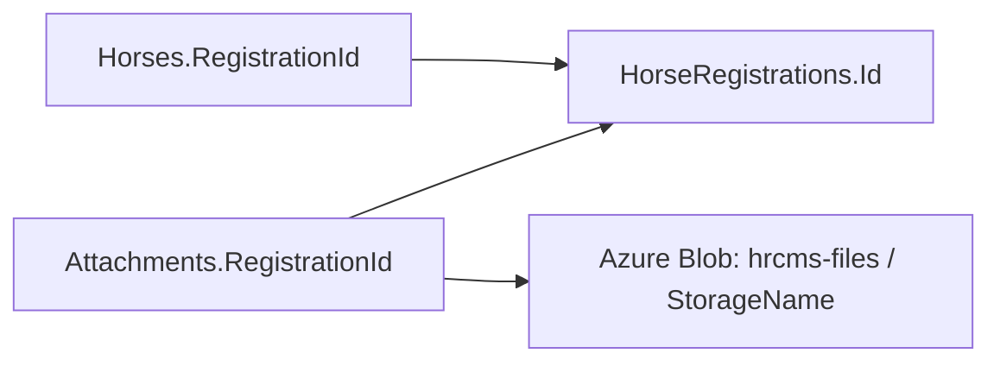

# Ảnh ngựa trên Azure Blob

Ảnh không nằm trực tiếp trong bảng Horses. Bảng Attachments đã lưu FileName, StorageName (blob key), ContentType, Length, Type và RegistrationId. Quan hệ:

Ảnh ngựa có Type = HorsePhoto. Cấu hình ứng dụng mặc định dùng AzureBlob, account hrcmsg2 và container private hrcms-files. Access key/credential ở User Secrets; không đưa vào database hoặc frontend. Không có fallback sang local khi Azure gặp lỗi. Local provider chỉ được cấu hình riêng trong fixture kiểm thử.

Tại màn hình tạo hồ sơ, chọn PNG/JPEG và xem trước. Khi lưu, frontend tạo bản nháp rồi POST multipart vào `/api/registrations/{id}/attachments` với type HorsePhoto. Nếu upload thất bại, mã bản nháp được giữ để sửa/tải lại mà không tạo bản nháp mới. Khi chưa xác nhận được kết quả từ máy chủ, kiểm tra hồ sơ trước khi thử lại.

File chọn và ảnh xem trước chỉ ở bộ nhớ trình duyệt. API giữ multipart có giới hạn trong bộ nhớ, không ghi file ảnh tạm ra disk; nội dung ảnh được ghi vào Azure. Database lưu metadata sau upload trong transaction. Blob không được tham chiếu sau rollback sẽ được dọn theo cơ chế UploadStorage.

`GET /api/horses/{id}` trả `photo` gồm attachmentId, fileName, storageName, contentType, length, contentUrl. `GET /api/horses/{id}/photo` kiểm tra quyền rồi stream ảnh từ Azure. Không lưu URL SAS hết hạn; URL Blob private không dùng trực tiếp làm ảnh public. Không cần thêm bảng hoặc migration trùng thông tin đã có.

Giới hạn mặc định: PNG/JPEG, 10 MiB/tệp, 20 tệp/hồ sơ; kiểm tra cả đuôi file và chữ ký nội dung. Metadata ảnh luôn trỏ đến ảnh HorsePhoto mới nhất trong hồ sơ.
