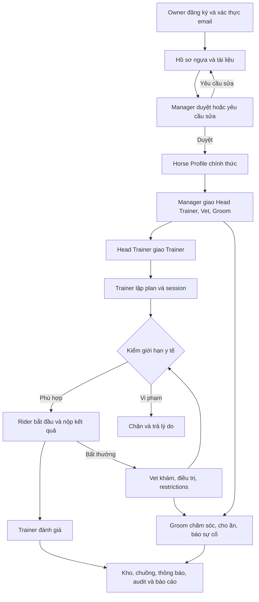

# Phân tích HRCMS và danh sách công việc còn lại

Ngày rà soát: 04/10/2026. Cơ sở: mã nguồn tại checkout `main`, commit `f222964`, README, tài liệu trong docs, migration, cấu hình CI và mã kiểm thử.

**Cập nhật bước 6:** đã bổ sung storage transaction cleanup, chống traversal/link, key encryption và công cụ backup/verify/restore SQLite; kiểm native SQL backup vào DB mới. Suite 61 ca: SQL Server 60 pass/1 skip, SQLite 48 pass/13 skip. Xem [STORAGE_AND_RECOVERY.md](STORAGE_AND_RECOVERY.md). T41 đã xử lý consistency/restore trong phạm vi này; orphan sau kill-process, retention và offsite backup vẫn còn. Các nhận định thiếu backup/tests bên dưới thuộc snapshot ban đầu. Bước tiếp theo là đối soát báo cáo/KPI, scope từng role và biên ngày/timezone của backend; frontend tiếp tục hoãn theo người dùng.

Đây là phân tích tĩnh của repository backend. Không thay đổi mã nghiệp vụ, không truy cập hay thay đổi database local. Máy hiện tại có .NET runtime 10.0.12 nhưng `dotnet --info` báo không có SDK, nên chưa chạy lại build/test. Không khẳng định 21 test đang pass ở checkout này. Không đọc thiết kế Figma, repository frontend riêng hoặc bản Word đặc tả nguồn; mức độ khớp các nguồn này là task cần kiểm chứng, không phải kết luận đã nghiệm thu.

**Cập nhật sau khi thực hiện bước chuẩn bị môi trường cùng ngày:** máy đã có SDK 10.0.401; restore/build thành công (0 warning, 0 error), bộ test hiện tại pass 21/21 khi chạy ngoài sandbox. Đã tạo riêng `HorseClub_IntegrationTest` trên `.\SQLEXPRESS`, áp schema thành công và kiểm backend `/health` + OpenAPI HTTP 200. Đây là smoke test SQL Server, chưa phải workflow/concurrency test SQL Server. Những mô tả chưa có SDK/chưa chạy test bên dưới phản ánh thời điểm phân tích ban đầu. Xem [kết quả bước 1](ENVIRONMENT_SETUP_PROGRESS.md).

**Cập nhật bước 3:** bộ test đã mở rộng lên 34 trường hợp; SQL Server local 34 pass, SQLite 27 pass/7 SQL-only skip. Đã kiểm thêm workflow/rollback/FK/concurrency và sửa deadlock response 500 -> 409. Các nhận định "SQL Server chưa có workflow tests" bên dưới phản ánh snapshot phân tích ban đầu; xem [kết quả hiện tại và giới hạn](SQLSERVER_TESTING.md). Không có thay đổi policy mới hoặc frontend ở bước 3.

## 1. Dự án giải quyết vấn đề gì?

**Cập nhật bước 5:** đã kiểm worker retry/timeout/expiry/cancellation/restart, reminder recipient/timezone và hai host SQL Server. Sửa marker khi chưa có Vet, khóa dùng chung cho worker, commit email từng message và queue hết hạn; thêm migration WorkerDeliveryReliability cho hai provider. Các nhận xét thiếu worker tests bên dưới thuộc snapshot ban đầu. SMTP bên ngoài và tách delivery khỏi gate vẫn còn; xem [kết quả và giới hạn worker](WORKER_RELIABILITY.md).

**Cập nhật bước 4:** hoàn thiện schema/status/security/upload cho 96 operations, bổ sung named response DTO và typed workflow; 3 test contract mới kiểm toàn bộ operation và request/response runtime. Các mô tả OpenAPI thiếu schema bên dưới thuộc snapshot ban đầu; xem [contract hiện tại](API_CONTRACT.md). Frontend và các policy đề xuất vẫn được hoãn/chưa phê duyệt.

HRCMS là hệ thống quản lý câu lạc bộ và huấn luyện ngựa đua. Đối tượng trung tâm là một con ngựa, đi qua vòng đời tiếp nhận hồ sơ, duyệt, phân công nhân sự, huấn luyện, theo dõi y tế, chăm sóc và lưu lịch sử.

Giá trị của hệ thống nằm ở việc phối hợp giữa nhiều người: Trainer không được tự bỏ qua giới hạn của Vet; Rider chỉ thực hiện buổi được giao; Owner chỉ xem ngựa của mình; Groom làm công việc chăm sóc được giao; Manager điều phối nhân sự và vận hành. Vì thế dự án không chỉ là CRUD bảng dữ liệu: trạng thái, quyền trên từng con ngựa, giới hạn y tế và lịch sử quyết định là phần quan trọng nhất.

Luồng tổng thể:



Đăng ký tài khoản Owner và đăng ký hồ sơ ngựa là hai nghiệp vụ riêng. Một Owner có thể có nhiều hồ sơ/ngựa; hồ sơ chờ duyệt chưa phải Horse Profile chính thức.

## 2. Hiện trạng và phạm vi

| Thành phần | Quan sát tại repository |
| --- | --- |
| Backend | Có ASP.NET Core Minimal API, BLL, DAL và các module nghiệp vụ |
| Database | Có 31 DbSet nghiệp vụ, migration riêng SQLite/SQL Server và SQL tạo schema |
| Kiểm thử | 17 Fact và 1 Theory có 4 InlineData: tương ứng 21 trường hợp theo cấu trúc mã nguồn |
| CI | Có restore/build/test bằng .NET 10 trên GitHub Actions; chưa kiểm tra trạng thái run trên GitHub |
| Frontend | Không có code frontend trong checkout; README dẫn sang repository riêng |
| Figma | README nói thiết kế đã hoàn thành theo nhóm; chưa đối chiếu trực tiếp trong lần rà soát này |
| Email | Có outbox, SMTP sender và worker; Development ghi email ra file |
| Triển khai | Có hướng dẫn cấu hình; chưa thấy manifest deploy/container hay bằng chứng staging trong repo |
| Báo cáo | Có API KPI, dữ liệu bảng và series để frontend vẽ; chưa có export PDF/Excel |
| Thi đấu | Flow 5 nằm ngoài phạm vi được tài liệu hiện tại xác định |

Không thể suy ra phần trăm hoàn thành từ số endpoint. Có API là dấu hiệu đã triển khai; chưa đồng nghĩa đã khớp Figma, được kiểm trên SQL Server, chạy qua UI hay sẵn sàng production.

Ba tài liệu cần đọc theo bối cảnh:

- `IMPLEMENTATION_PLAN.md`: kế hoạch ban đầu, còn câu chỉ có WeatherForecast; không dùng làm mô tả hiện trạng.
- `BACKLOG.md`: 28 nhóm yêu cầu HC-001–HC-028; nhiều nhóm đã có code, cần đối chiếu nghiệm thu thay vì viết lại.
- `BACKEND_TASK_ASSIGNMENT.md`: 14 task BE-001–BE-014 để rà, hoàn thiện, kiểm chứng và tích hợp; phù hợp hiện trạng hơn. Nhắc PR #1 là thông tin lịch sử cần xác minh nếu dùng để chọn base branch. Checkout đang đọc là `main` và đã có backend.

`ARCHITECTURE.md` còn mô tả monorepo/frontend dự kiến trong cùng repo và SQL Server chưa test thật, trong khi README xác định frontend ở repo riêng và nêu đã smoke-test SQL Server local. Chỉ code model/migration được xác minh ở đây; không suy ra trạng thái database đang chạy trên máy.

## 3. Bảy vai trò và phạm vi quyền

| Vai trò | Trách nhiệm chính đang có | Giới hạn cần hiểu |
| --- | --- | --- |
| HorseOwner | Đăng ký account; tạo/sửa/gửi hồ sơ; xem ngựa, training, care và báo cáo thuộc mình | Không chọn Trainer; không duyệt hồ sơ; không đọc clinical records |
| ClubManager | Tạo/disable staff; duyệt hồ sơ; phân công Head Trainer/Vet/Groom; chuồng, kho, audit | Không có quyền thay Vet tạo clearance; clinical records chỉ Vet, nhưng care treatment instructions hiện Manager đọc được |
| HeadTrainer | Quản lý template; giao Trainer cho ngựa mình phụ trách; theo dõi training | Không được sửa training thay Trainer hiện tại; không override medical guard |
| Trainer | Lập/sửa plan và session; giao Rider; đánh giá kết quả | Phải là Trainer đang được phân công; không chẩn đoán/clearance |
| WorkRider | Xem session được giao; start/skip/nộp kết quả; ghi bất thường | Không tự sửa lịch, giao người hoặc nộp kết quả session người khác |
| Veterinarian | Khám, correction, injury, restriction, treatment, follow-up/clearance, preventive care; giao treatment/ice bath | Chỉ với ngựa trong scope được giao; treatment khác daily care |
| Groom | Ghi care task được giao; feeding, incidents/photos; cleaning trong scope; xuất kho và yêu cầu bổ sung | Không quyết định y tế; không tự giao task; không nhập tăng stock |

Một User có một trường `Role`, không có hệ thống nhiều role/user hoặc bảng Permission động. Phân quyền hiện là enum và logic trong code.

Kiểm quyền có ba mức:

1. Authentication: Bearer token hợp lệ.
2. Account: `CurrentUser` kiểm Active, EmailVerified và security stamp.
3. Resource scope: `ClubAccess` kiểm OwnerId, assignment còn Active hoặc session giao Rider; workflow kiểm thêm action/role.

Ẩn nút ở frontend chỉ hỗ trợ trải nghiệm. Quyền thực tế phải luôn được backend kiểm. Rider hiện được xem Horse nếu từng có session giao mình, không giới hạn session còn hoạt động; đây là policy phải chốt nếu muốn thu hồi quyền khi nhiệm vụ kết thúc.

## 4. Kiến trúc và cách đọc code

```text
Frontend riêng
    -> HTTP /api + Authorization: Bearer
Horse_BackEnd: endpoint, validation/filter, middleware, DI/startup
    -> HorseClub.BLL: workflow, service, quyền, DTO, message, workers
    -> HorseClub.DAL: entities/enums, EF Core context, migrations
    -> SQLite cho test/local hoặc SQL Server theo cấu hình

Phụ trợ: filesystem uploads + Data Protection keys + email outbox/SMTP
```

| Nơi đọc | Nội dung |
| --- | --- |
| `Horse_BackEnd/Program.cs` | Cấu hình JSON enum, DI, providers, auth, CORS, rate limit, bootstrap, workers, route mapping |
| `Horse_BackEnd/Endpoints/` | Các đường dẫn HTTP và binding; gọi workflow |
| `Horse_BackEnd/Infrastructure/HttpPipeline.cs` | Validate request, filter role, lỗi và transaction |
| `HorseClub.BLL/Contracts/Requests.cs` | DTO request và validation |
| `HorseClub.BLL/Infrastructure/ApiSupport.cs` | CurrentUser, ClubAccess, Ensure, events, pagination, WriteGate |
| `HorseClub.BLL/Services/` | Auth, intake/approval/assignment, training guard/execution và workers |
| `HorseClub.BLL/Workflows/` | Các thao tác nghiệp vụ theo module |
| `HorseClub.DAL/Domain/` | Entities và enum role/status/type |
| `HorseClub.DAL/Data/ClubDbContext.cs` | 31 bảng, FK/index, precision, conversion thời gian, concurrency token |
| `tests/Horse_BackEnd.Tests/` | Integration tests API và kiểm layer/message/model |

Các namespace `Horse_BackEnd.*` trong BLL/DAL được giữ theo tài liệu; vị trí file/project và assembly mới phản ánh layer. BLL có dùng `HttpContext`, `Results`, host/config và EF trực tiếp: có tách project nhưng chưa phải business layer độc lập hoàn toàn với ASP.NET Core. Hiện không có repository pattern và không cần tự thêm chỉ để tăng số lớp.

Một write request thường đi như sau: middleware giữ WriteGate -> mở transaction Serializable -> endpoint/filter validate -> workflow/service kiểm quyền và trạng thái -> thay dữ liệu + audit/notification -> SaveChanges -> commit -> trả response. Response được buffer để chỉ gửi sau commit. Các write request được tuần tự hóa trong một process; gate không phối hợp giữa nhiều process/replica.

Auth dùng opaque bearer tokens của ASP.NET Core Data Protection, không phải JWT. Logout/reset/disable staff đổi security stamp, thu hồi token toàn account. Refresh token chưa có rotation/thu hồi riêng từng thiết bị. Keys phải được lưu bền vững; mất key ảnh hưởng token và NationalId đã bảo vệ.

## 5. Dữ liệu và quan hệ cần hiểu

| Nhóm | Các bảng/entity chính | Quan hệ nghiệp vụ |
| --- | --- | --- |
| Tài khoản | User, EmailChallenge, EmailMessage | Challenge xác thực/reset/invitation; EmailMessage là outbox |
| Tiếp nhận | HorseRegistration, Attachment, Horse, Measurement, StaffAssignment | Registration được duyệt tạo một Horse; measurement và assignments giữ lịch sử |
| Huấn luyện | TrainingTemplate, TrainingPlan, TrainingSession, SessionResult, TrainerEvaluation, TrainingRevision | Template -> nhiều plan -> nhiều session; mỗi session tối đa một result và một evaluation |
| Y tế | MedicalRecord, Injury, MedicalRestriction, TreatmentPlan, MedicalFollowUp, PreventiveCare | Hồ sơ khám liên kết injury/restriction/treatment; follow-up nối lần khám trước và mới |
| Vận hành | Stable, Stall, StallOccupancy, CareTask, Incident, IncidentPhoto | Stable có stall; occupancy lưu việc ở chuồng theo thời gian; care/incident gắn horse |
| Kho | InventoryItem, StockMovement, ReplenishmentRequest | Stock là số hiện tại được cập nhật cùng lịch sử movement; approval bổ sung chưa phải receipt |
| Dùng chung | Notification, AuditEvent | Notification theo recipient; audit theo actor/action/reference |

Unique indexes đã có cho Email, UserName, Horse.RegistrationId, Result.SessionId, Evaluation.SessionId. Assignment có index tra cứu nhưng chưa unique để bảo đảm chỉ một assignment Active cho mỗi horse/role. Occupancy chưa có filtered unique index bảo vệ một stall/một horse chỉ có một occupancy mở.

Không phải mọi field `*Id` đều có FK: cần rà StaffId/GroomId/ActorId/RecipientId, challenge UserId, treatment InjuryId, follow-up records và các quan hệ khác theo ý nghĩa. ReferenceId của audit/notification là tham chiếu đa loại, không thể áp một FK chung vào một bảng tùy ý.

Entity có `Version`, được tăng khi SaveChangesAsync sửa entity và dùng optimistic concurrency. Phải kiểm cách nó tương tác với transaction/deadlock trên SQL Server, không suy ra test SQLite đã bao phủ.

Timestamps được converter lưu thành UTC ticks (`long`), kể cả provider SQL Server; không mặc định cho rằng cột SQL là datetimeoffset. DateOnly dùng cho ngày nghiệp vụ. Decimal mặc định precision 18, scale 3: cần thử dữ liệu gần biên và phép làm tròn stock, portion, distance để giữ số liệu nhất quán.

## 6. Vòng đời từng module

### Account và staff

Owner register -> account chưa verify -> email code -> verify -> login. Manager tạo staff -> invitation -> staff chọn mật khẩu -> account verify. Có forgot/reset, resend, attempt limits, lockout và refresh/logout. Code challenge lưu hash; email outbox giữ nội dung có code trước khi gửi và xóa body khi gửi thành công. Development file mail vẫn chứa code nên cần retention phù hợp.

Chưa thấy API cập nhật profile, đổi password khi đang đăng nhập, resend invitation hoặc đổi role staff. Chỉ triển khai thêm khi các màn hình/yêu cầu đã chốt cần chúng. Invitation hết hạn hiện là điểm cần chốt cách hỗ trợ staff kích hoạt lại.

### Intake, profile và assignments

```text
Draft -> PendingReview -> Approved -> tạo Horse + Measurement
                    -> RevisionRequired -> sửa -> PendingReview
Draft/RevisionRequired -> Cancelled
```

Draft hiện vẫn yêu cầu bộ dữ liệu RegistrationRequest đầy đủ và hợp lệ; không có partial draft/autosave. Nếu Figma cho lưu hồ sơ chưa điền hết, cần sửa contract. Submit bắt buộc có HorsePhoto và Certificate. Khi review không approve, hệ thống yêu cầu sửa chứ chưa có trạng thái Rejected. Manager có thể sửa hồ sơ PendingReview; cần xác nhận có cho phép thay nội dung Owner gửi hay không.

Owner chỉ đề xuất HeadTrainer/Groom/Vet. Manager tạo assignment chính thức; preferences không được tự động coi là assignment. HeadTrainer đang phụ trách mới được giao Trainer. Assignment thay thế kết thúc bản cũ và tạo bản mới; chưa hỗ trợ bắt đầu tương lai hay endpoint unassign riêng.

Horse archive giữ dữ liệu và đóng occupancy, nhưng chưa tự đóng assignments/plans/care tasks hoặc cho đọc lại profile qua endpoint thông thường. Cần định nghĩa chính sách history và công việc còn mở sau archive.

### Training

HeadTrainer tạo template; Trainer tạo plan tham chiếu template và truyền goal/phase/date/notes. Distance/intensity/surface của template không tự sinh session; chưa có chức năng sinh lịch theo frequency.

```text
Plan: Active <-> Paused; từ Active/Paused có thể Completed hoặc Archived
Session: Planned -> Assigned -> InProgress -> Completed hoặc IssueReported
Session chưa final có thể Skipped
```

Complete plan yêu cầu không còn buổi pending; archive plan skip buổi chưa bắt đầu. Completed/Archived plan không được mở lại bằng code hiện tại.

Create/edit/assign session đều kiểm medical guard tại lịch dự kiến. Start kiểm lại theo thời điểm thực tế, plan active và rider/horse không đang chạy buổi khác. Khi lên lịch chỉ kiểm Rider trùng chính xác ScheduledAt; không có duration/end time, không kiểm full overlap hoặc horse trùng lịch tại bước schedule.

Rider nộp distance/time/intensity/feedback; server tính speed bằng mét/giây. Nếu restriction xuất hiện giữa buổi, result vẫn được nhận, chuyển IssueReported và tạo incident. Evaluation lưu Comment và AdjustFutureSessions; cờ true không tự thay các buổi tương lai. Nếu muốn điều chỉnh, Trainer phải dùng edit session; luồng UI và history cần được chốt.

### Medical

Vet được giao ngựa mới đọc clinical records và tạo khám/injury/restriction/treatment/follow-up. Correction thêm bản mới với SupersedesRecordId, giữ bản cũ. Health summary/restriction reason là thông tin vận hành được nhiều role trong horse scope đọc; không nhập diagnosis vào reason nếu muốn giữ riêng.

Guard hiện tại: Isolated chặn mọi training; Injured chặn Heavy; TrainingLock chặn Heavy; BlockAllTraining chặn mọi intensity; các giới hạn MaxIntensity/MaxDistance/NoSprint chặn hoạt động không phù hợp. Monitoring không tự chặn training. Đây là chính sách trong code cần Club nghiệm thu.

Clearance yêu cầu lần khám mới Fit, đóng mọi restriction chưa cleared, injury Active và treatment chưa completed của cả horse, kể cả restriction cho tương lai. Không tự resume plan. Injury Recovering có trong enum nhưng chưa có API chuyển trạng thái độc lập và không nằm trong điều kiện đóng injury hiện tại. Nếu cần theo từng injury/treatment, phải đổi contract/lifecycle.

PreventiveCare hiện là lịch đơn lẻ vaccination/deworming/farrier và completion; chưa tự sinh lịch định kỳ.

### Care, incidents, stable và inventory

Manager giao daily care; Vet giao Treatment/IceBath; Groom được giao horse/task mới ghi InProgress/Completed/Skipped/IssueReported. Feeding có ApprovedPortionKg và ActualPortionKg, chưa gắn trực tiếp việc cho ăn với StockMovement.

Incident có reporter, horse, severity, routed role Trainer/Vet và resolved. Groom/Rider xem incident do mình báo; Trainer/Vet xem theo route hoặc reporter; Manager xem theo scope. Resolve hiện chỉ đổi bool, chưa có kết luận xử lý/resolver/time riêng.

Occupancy Manager quản lý và giữ history. Stall cleaning đổi trạng thái Clean và ghi audit; chưa có lifecycle tự quay lại NeedsCleaning khi stall đổi occupancy.

Manager tạo item/nhập stock; Groom/Manager xuất; stock không âm theo guard. Replenishment Pending -> Approved/Rejected, không tăng stock khi duyệt. Receipt là positive movement riêng, chưa liên kết cụ thể với request mua hàng.

### Dùng chung và báo cáo

Notification lưu trong database; đọc danh sách/mark read qua API. Chưa có SignalR/push realtime. EmailWorker retry SMTP; ReminderWorker nhắc preventive care, session overdue và follow-up. Tests tắt workers, vì vậy workflow tests chưa kiểm phần delivery/reminder thực tế.

Reports có horse/date/groupBy, KPI completion/distance/time/care/medical, series và bảng. Owner/Manager có medical count, Vet có clinical details; Rider chỉ training của mình, Groom chỉ care của mình trong report. Dashboard hiện có chung một cấu trúc, chưa tương đương dashboard chuyên biệt từng role theo Figma.

## 7. Điểm cần xử lý được phát hiện từ code

Các quan sát dưới đây không được diễn giải thành lỗi đã tái hiện runtime; mức ảnh hưởng phải được test sau khi có SDK/database test.

| Quan sát | Bằng chứng code | Hệ quả/task |
| --- | --- | --- |
| Backdated medical record vẫn ghi HealthStatus hiện tại | MedicalWorkflow.PostRecords/PostFollowUps gán trực tiếp HealthStatus | Hồ sơ cũ nhập sau có thể thay trạng thái mới; cần quy tắc latest/correction và test |
| Chỉ che care notes/instructions khi Type=Treatment | CareWorkflow.GetTasks, điều kiện `x.Type != CareType.Treatment` | IceBath do Vet giao có thể chứa hướng dẫn riêng nhưng Owner vẫn đọc; cần chốt và áp field policy cho mọi loại care y tế |
| Clinical report cắt 100; plan detail cắt 100 session | ReportingWorkflow.BuildReport; TrainingWorkflow.GetPlansById | UI có thể hiểu sai dữ liệu đầy đủ; thêm pagination/total hoặc báo limit |
| Dashboard overdue khác reminder | Dashboard dùng ScheduledAt < now; worker dùng OverdueAfterMinutes và plan Active | KPI/notification không cùng định nghĩa; thống nhất hoặc đặt tên phân biệt rõ |
| Preventive reminder đánh dấu sent dù không có Vet recipient | BackgroundWorkers: vòng recipient rồi ReminderSent=true | Giao Vet sau có thể không nhận reminder; thêm retry/recipient-aware tracking |
| WriteGate dùng chung cho tất cả writes và SMTP | TransactionMiddleware và EmailWorker | Gửi mail chậm chặn write trong process; cần đo và tách delivery nếu triển khai |
| Ghi file trước khi transaction DB commit | AttachmentWorkflow/IncidentPhotoWorkflow | DB rollback có thể để lại file mồ côi; cần cleanup/compensation |
| Training history chưa ghi mọi transition | Start/SubmitResult/Skip/Evaluation có audit nhưng không gọi TrainingHistory | Nếu UI history cần đủ trạng thái, bổ sung snapshot/events theo contract |
| Xung đột lịch mới dựa cùng instant cho Rider | TrainingService.ApplySession | Chưa đảm bảo horse/rider không overlap theo thời lượng |
| Evaluation true chỉ lưu cờ | TrainingWorkflow.PostSessionsByIdEvaluation | Không được hiển thị rằng lịch đã tự điều chỉnh |
| Return nhiều anonymous objects và Task<object> | Endpoints và Workflows | Cần kiểm response schemas OpenAPI; typed response DTO/metadata giúp FE hiểu field, nullability và lỗi |

## 8. Danh sách task có thể giao việc

Danh sách dưới đây bao quát phần còn lại xác định được từ checkout. Không thể bảo đảm mọi task theo Word/Figma khi chưa đối chiếu nguồn yêu cầu. P0 là chặn core/tích hợp/nghiệm thu; P1 là hoàn thiện phạm vi và độ tin cậy; P2 là mở rộng chỉ thực hiện khi xác nhận scope. Ưu tiên là đề xuất rà soát này, không tự thay đổi ưu tiên BE-001–BE-014 của nhóm.

### A. Yêu cầu, môi trường và contract

| ID | Ưu tiên / phụ trách | Công việc | Tiêu chí hoàn thành |
| --- | --- | --- | --- |
| T01 | P0 / BE01 | Đối chiếu Word V1/V2, Figma và frontend với code | Có bảng screen/action -> role -> endpoint/DTO -> trạng thái đã có/thiếu/lệch; xác nhận nguồn ưu tiên |
| T02 | P0 / Lead + chủ module | Chốt medical lock, clearance, lịch, draft, archive, visibility | Mỗi policy có ví dụ được/không được và người nghiệm thu; không để FE tự đoán |
| T03 | P0 / BE01 | Chuẩn bị .NET 10 SDK và run/build/test trên máy mới | Restore/build/test có log; API local chạy được với cấu hình mẫu không chứa secret |
| T04 | P0 / BE05 | Chuẩn bị SQL Server database test riêng | Migration/SQL áp được trên DB test; không reset HorseClub đang dùng; health và data access pass |
| T05 | P0 / BE01 | Chuẩn hóa response DTO/OpenAPI và mẫu lỗi | Schema cho success/error/upload/pagination thể hiện đúng fields/nullability/enum; auth failure và throttling có contract rõ |
| T06 | P0 / BE01 | Mở rộng HTTP/Postman collection | Chạy đủ flow Owner -> approval -> assign -> training -> medical -> care, gồm các ca bị từ chối |
| T07 | P1 / BE01 | Cập nhật tài liệu hiện trạng | Sửa WeatherForecast/monorepo/SQL test/PR base đã lỗi thời; tách kế hoạch lịch sử khỏi hướng dẫn hiện tại |

### B. Identity, phân quyền và hồ sơ ngựa

| ID | Ưu tiên / phụ trách | Công việc | Tiêu chí hoàn thành |
| --- | --- | --- | --- |
| T08 | P0 / BE01 | Ma trận permission theo action/resource/field cho 7 role | Test direct API cross-owner/cross-assignment, role sai và tài khoản inactive; không chỉ kiểm menu |
| T09 | P0 / BE01 | Bổ sung test OTP/reset/invitation expiry/resend/reuse/lockout | Có deterministic clock cho biên TTL, giới hạn attempts và resend; revoked tokens bị chặn |
| T10 | P0 / BE01 | Chốt và tích hợp token lifecycle frontend | Login/refresh/logout/reset/401 hoạt động; không gửi refresh lặp không kiểm soát; hiểu logout thu hồi toàn account |
| T11 | P1 / BE01 | Luồng hỗ trợ invitation hết hạn và profile/password nếu cần | Theo contract màn hình; staff kích hoạt lại được, có audit/rate limits và không tự chọn role |
| T12 | P0 / BE02 | Nghiệm thu intake/revision/resubmit/approval | Required docs đúng; Owner không chọn Trainer; pending chưa có Horse; approval đồng thời chỉ tạo một Horse |
| T13 | P1 / BE02 | Chốt draft chưa đầy đủ và cancel/reject | UI và backend thống nhất field tối thiểu, autosave hay full draft; trạng thái không mập mờ |
| T14 | P0 / BE02 | Assignment/reassignment và scope sau thay nhân sự | Chỉ HeadTrainer hiện tại giao Trainer; history còn; staff cũ không sửa; định nghĩa quyền Rider còn lại |
| T15 | P1 / BE02 | Profile/measurement/boarding và archive lifecycle | Timeline, latest measurement tie-break, dữ liệu profile theo màn hình; archive xử lý pending tasks/assignments/history đúng policy |
| T16 | P1 / BE02 + BE04 | Vòng đời attachments và replacement | Ảnh/chứng nhận thay sai được xử lý theo policy; file không public; role tải đúng; certificate metadata/expiry thống nhất |

### C. Training và medical

| ID | Ưu tiên / phụ trách | Công việc | Tiêu chí hoàn thành |
| --- | --- | --- | --- |
| T17 | P0 / BE02 | Template -> plan -> sessions theo contract | Chốt việc copy defaults/sinh lịch hay nhập thủ công; template archive không phá history; transitions plan đúng |
| T18 | P1 / BE02 | Duration và overlap lịch horse/rider | Chốt Planned/Assigned ảnh hưởng slot; kiểm khoảng thời gian cả create/edit/assign và concurrency; không chỉ cùng timestamp |
| T19 | P0 / BE02 + BE03 | Medical guards trong cả lifecycle session | Test create/edit/assign/start, restriction tương lai/hết hạn, nhiều restriction, lock giữa buổi và health statuses |
| T20 | P0 / BE02 | Execution/result/evaluation | Rider đúng người, start đúng thời điểm, duplicate bị chặn, đơn vị/speed đúng, bất thường tạo incident |
| T21 | P1 / BE02 | Evaluation adjustment và training history | Cờ yêu cầu sửa không bị coi là đã sửa; chỉnh future sessions giữ history; start/result/skip hiển thị timeline theo yêu cầu |
| T22 | P0 / BE03 | Health status khi nhập hồ sơ khám cũ/correction | Hồ sơ có ExaminationAt cũ không vô ý đổi trạng thái mới; test correction chain và follow-up nhập lệch thứ tự |
| T23 | P0 / BE03 | Chốt clearance toàn ngựa hay từng injury | Không đóng restriction/treatment không thuộc clearance ngoài ý muốn; xử lý Recovering/future restriction; plan không tự resume |
| T24 | P0 / BE03 + BE04 | Visibility clinical/restriction/care y tế | Không lọt diagnosis/instructions qua summary/report/notes/IceBath/attachments; Manager và Owner có policy rõ |
| T25 | P1 / BE03 | Lifecycle injuries/treatments/restrictions | Theo yêu cầu có sửa/đóng riêng, Active/Recovering/Recovered, completion và history; không chỉ clearance toàn ngựa |
| T26 | P1 / BE03 + BE05 | Preventive care due/overdue/completion | Ngày theo timezone đúng; reminder đúng recipient, có retry khi chưa gán Vet; recurrence chỉ thêm nếu yêu cầu |

### D. Care, chuồng, incidents và kho

| ID | Ưu tiên / phụ trách | Công việc | Tiêu chí hoàn thành |
| --- | --- | --- | --- |
| T27 | P1 / BE04 | Care/treatment/feeding workflow | Groom chỉ ghi việc được giao; approved/actual portion đúng; task final không bị ghi lại; treatment hoàn tất không để task sai |
| T28 | P1 / BE04 | Incident routing/photos/resolution | Role nhận đúng, list/detail/photo scope nhất quán, ghi kết luận xử lý nếu màn hình cần; notify/audit không lặp ngoài ý muốn |
| T29 | P1 / BE04 | Stall occupancy/cleaning lifecycle | Không double-book, move/vacate/archive giữ history; status cleaning và lịch sử phù hợp; Groom scope đúng |
| T30 | P1 / BE04 | Inventory precision/movements/low stock | Không stock âm, movement và stock đối soát được; nhập/xuất đúng quyền; kiểm decimal gần 0 và threshold |
| T31 | P1 / BE04 | Replenishment review và actual receipt | Duyệt không tăng kho, receipt có history; liên kết request/receipt nếu thuộc yêu cầu |
| T32 | P2 / BE04 | Liên kết care feeding/treatment với inventory | Chỉ làm nếu cần tự trừ kho; chống ghi trùng và giữ quan hệ rõ giữa task và movement |

### E. Báo cáo, workers và dữ liệu

| ID | Ưu tiên / phụ trách | Công việc | Tiêu chí hoàn thành |
| --- | --- | --- | --- |
| T33 | P0 / BE05 | Reports/dashboard đúng scope và số liệu | Đối soát KPI với source; boundary day/week/month, no-data, filters và dashboard theo 7 role; không lộ hoạt động ngoài scope |
| T34 | P1 / BE05 + BE02 | Xử lý dữ liệu bị cắt 100 bản ghi | Plan session list và clinical report có pagination/total hoặc explicit limit; UI không hiểu dữ liệu thiếu là toàn bộ |
| T35 | P1 / BE05 | Thống nhất định nghĩa overdue | KPI và reminder dùng cùng threshold/plan policy hoặc tên thể hiện rõ khác nhau; test paused/archived |
| T36 | P0 / BE05 | Kiểm workers và SMTP thực tế | Test send/retry/expiry/order/max attempts/restart, duplicate delivery và recipient; worker tests không bị bỏ do Enabled=false |
| T37 | P1 / BE01 + BE05 | Tách SMTP khỏi gate và DB transaction nếu deploy | Đo latency trước/sau; claim/lease/idempotency bảo đảm không hai worker gửi cùng message ngoài policy at-least-once |
| T38 | P1 / BE05 | Notification/audit/history coverage | Mỗi quyết định có actor/action/time/reference đúng; read theo user; recipient inactive/reassignment không gây mất hay lộ thông tin |
| T39 | P0 / BE05 | Integration/concurrency tests SQL Server | Approval, assignment, stall, stock, medical lock-vs-start, clearance, correction, transaction rollback và deadlock có kết quả rõ |
| T40 | P1 / BE05 | Rà FK/index/constraints và migration hai provider | Các quan hệ quan trọng không orphan; active assignment/occupancy có ràng buộc DB khi phù hợp; script và model đồng bộ |
| T41 | P1 / BE04 + BE05 | Storage consistency và retention | Upload DB rollback không bỏ rác vô hạn; missing file có xử lý; backup/restore đồng bộ DB/files/keys; cleanup mail/challenges/outbox theo policy |
| T42 | P1 / BE05 | CI tăng bằng chứng kiểm thử | Lưu TRX/artifacts; chạy SQL Server suite khi sẵn sàng; có kiểm migration/model; không tuyên bố coverage khi chưa đo |

### F. Frontend, UAT và bàn giao

| ID | Ưu tiên / phụ trách | Công việc | Tiêu chí hoàn thành |
| --- | --- | --- | --- |
| T43 | P0 / FE + BE01 | Nhận frontend và cấu hình integration | Xác minh mã frontend thực tế; API base URL/CORS môi trường đúng; enum/date/unit/upload thống nhất |
| T44 | P0 / FE + chủ module | Tích hợp đầy đủ các màn hình nghiệp vụ | Auth/intake/review/profile/assign/template/plan/session/rider/medical/care/stable/inventory/notifications/audit/reports kết nối đúng API |
| T45 | P0 / FE + QA | UI states và xử lý lỗi | Loading/empty/validation/401/403/409/413/429; ngăn double-submit; refresh và retry không nhân đôi thao tác |
| T46 | P0 / BE05 + cả nhóm | Seed demo, E2E/regression/UAT 7 role | Chạy luồng xuyên suốt và ca vượt quyền; dữ liệu giả; chốt tiêu chí pass với reviewer |
| T47 | P0 khi deploy / BE01 + BE05 | Staging/production setup và release | HTTPS/CORS/SMTP/secrets/persistent storage/keys/migrations/health/logs đúng; smoke test; backup restore và rollback có bằng chứng |
| T48 | P0 / Lead + cả nhóm | Giao task, review và bàn giao | Assignee/reviewer/dependency/deadline rõ; fix blockers; hướng dẫn chạy/permission/policy còn giới hạn được cập nhật |

## 9. Mở rộng không mặc định thuộc phần cần giao ngay

Các mục sau chỉ lập issue triển khai khi nhóm xác nhận scope, ngoài 48 task rà soát/hoàn thiện phía trên:

- Export PDF/Excel, 3D injury map và global search nâng cao.
- Future assignment/unassign, nhiều Trainer/Groom đồng thời nếu thay policy một role trên horse.
- Refresh rotation/thu hồi từng thiết bị, nhiều role/user hoặc multi-club.
- UI master data chuẩn hóa breed/surface/category, thay vì text nhập tự do.
- Preventive/care recurrence và sinh lịch training tự động theo frequency.
- SignalR/push realtime; hiện có thể dùng polling theo API.
- Antivirus/quarantine/full content validation cho uploads nếu môi trường triển khai yêu cầu; hiện chỉ signature/extension/size.
- Procurement đầy đủ như vendor/PO/invoice/cost, payment/billing; không thấy các module này trong scope/mã hiện tại.
- Flow 5 thi đấu: tài liệu hiện xác định ngoài scope; không gộp vào backlog core.

## 10. Liên hệ với 14 task BE hiện có

| Task hiện có | Task chi tiết trong báo cáo |
| --- | --- |
| BE-001 Contract/Figma | T01, T02, T05 |
| BE-002 Auth/RBAC | T08–T11 |
| BE-003 Intake/assignment | T12–T16 |
| BE-004 Training | T17–T21 |
| BE-005 Medical | T19, T22–T25 |
| BE-006 Preventive | T26 |
| BE-007 Care/incident/photos | T24, T27, T28, T41 |
| BE-008 Stable/stall | T29, T39, T40 |
| BE-009 Inventory | T30–T32, T39 |
| BE-010 Report/notification/audit/worker | T33–T38 |
| BE-011 SQL/schema/test | T04, T39–T42 |
| BE-012 Integration prep | T03, T05, T06, T10, T43 |
| BE-013 Frontend integration | T43–T45 |
| BE-014 UAT/release | T46–T48 |

T07 cập nhật tài liệu xuyên suốt các nhóm. Các mã T là đề xuất để lập issue hoặc subtask, chưa phải GitHub issue đã tạo, chưa có người thật hay deadline.

## 11. Trình tự triển khai và phụ thuộc

1. T03/T04 dựng môi trường có thể kiểm chứng; T01/T02 chốt yêu cầu và policy; T05/T06 chốt contract/requests. Những việc này thực hiện được trước khi frontend được nhận.
2. Ưu tiên các điểm ảnh hưởng quyết định y tế/quyền/số liệu: T08, T19, T22–T24, T33, T39. Test và sửa trên DB test.
3. Chạy flow API: T12 -> T14 -> T17 -> T19/T20, cùng medical T22/T23 và care/kho/chuồng T27–T31. Chủ module viết test phần mình.
4. Sau khi có frontend: T43 -> T44/T45; xử lý mismatch theo contract đã chốt, không nới quyền để làm UI chạy.
5. T46 regression/UAT; T47 khi cần triển khai; T48 chốt bàn giao. Các mở rộng P2 không chặn core trừ khi nhóm đổi scope.

Không đặt ước lượng ngày dựa trên kế hoạch 8 tuần cũ. Cần số thành viên thực tế, năng lực, giờ/tuần, deadline và tình trạng frontend trước khi lập timeline đáng tin cậy.

## 12. Kịch bản nghiệm thu dự án

1. Owner đăng ký -> nhận mã -> verify -> login; login trước verify bị chặn.
2. Owner tạo hồ sơ -> upload ảnh/chứng nhận -> submit; thiếu tài liệu không submit được.
3. Manager yêu cầu sửa có lý do -> Owner sửa/resubmit -> Manager approve; chỉ có một Horse kể cả review đồng thời.
4. Manager xác nhận HeadTrainer/Vet/Groom -> HeadTrainer giao Trainer -> Trainer thấy đúng ngựa.
5. HeadTrainer tạo template -> Trainer lập plan -> tạo session Planned -> giao Rider -> Assigned.
6. Vet đặt restriction sau khi đã lên lịch -> Rider start session không phù hợp bị chặn; Trainer không override được.
7. Vet follow-up/clearance theo policy -> session phù hợp start được -> Rider nộp result -> Trainer đánh giá; result/evaluation trùng bị chặn.
8. Bất thường giữa buổi vẫn lưu result, tạo incident và notify đúng người; không lộ clinical notes cho Owner/Trainer/Rider.
9. Groom ghi care/feeding/treatment, approved/actual rõ; Groom khác không ghi được. Kho không âm, stall không double-book.
10. Mỗi role xem report/dashboard/notification đúng scope; số liệu khớp dữ liệu nguồn và timezone.
11. Disable staff/logout/reset thu hồi token theo policy; direct API không vượt scope dù đổi id hoặc bỏ UI.
12. Restart/restore không mất dữ liệu/files/keys; CI/test/UAT có bằng chứng, guide chạy được trên máy mới.

## 13. Kiểm thử đã có và còn thiếu bằng chứng

Mã test hiện có bao phủ: verify/reuse OTP, attempt limit/lockout, reset token revocation, invitation và role injection, intake/revision/approval/assignment/cross-owner, medical lock tại start và clearance, execution/evaluation, enum/config, refresh/logout, treatment privacy cho Treatment, care task ownership, stock không âm, approval đồng thời, upload signature, OpenAPI route presence, NationalId protection, intensity/distance/no-sprint, stall/archive, SQL Server model/migration generation, timezone, layer và messages.

Giới hạn cần nhớ:

- SQL Server test hiện sinh schema và kiểm migration/model, không kết nối chạy workflow thật trên SQL Server.
- Workers bị tắt trong ClubFactory; chưa chứng minh SMTP/reminder/retry hoạt động bằng suite hiện tại.
- OpenAPI test kiểm route/enum presence, chưa kiểm mọi response schema/status/error.
- Có test report/privacy nhưng chưa phải bộ đối soát đầy đủ KPI/date/groupBy/giới hạn và 7 role.
- Các test phần lớn dùng UTC và thời gian thật; cần mở rộng biên timezone và clock kiểm soát được.
- Chưa có UI E2E trong repo này. Frontend riêng có thể có test nhưng chưa được đọc.
- Không thể xác nhận test pass hiện tại vì chưa có SDK; cần chạy `dotnet build HorseClub.slnx --configuration Release` và `dotnet test HorseClub.slnx --configuration Release` sau khi chuẩn bị môi trường.

Tài liệu tham khảo nội bộ: [README](../README.md), [hướng dẫn backend](BACKEND_GUIDE.md), [phân công backend](BACKEND_TASK_ASSIGNMENT.md), [backlog yêu cầu](BACKLOG.md), [kiến trúc](ARCHITECTURE.md), [quy tắc layer/messages](THREE_LAYER_AND_MESSAGES.md), [hướng dẫn database](DATABASE_SQL.md).
